# Deep learning the Indus Script

## Abstract

Taking a step forward in the quest of deciphering the Indus scripts, we present in this paper a deep learnt Indus symbol segmentation architecture. It is capable of automatically locating text patches or regions and segmenting them out into individual symbols, given the images of Indus artifacts. Thus reducing a complex Optical Character Recognition problem on the Indus artifacts - especially seals - into a relatively simple symbol classification problem. The text patch extraction technique proposed has a 86% perfect proposal rate utilizing an improved Selective Search algorithm and a deep learnt patch classifier. This classifier was built with Convolutional Neural Networks to filter out the non text patches from the proposed candidates. While the symbol extractor has a 68% perfect symbol crop rate utilizing a custom built algorithm that is based on Otsu thresholding and connected component analysis. The benchmarks set by the two modules were based on empirical evaluation over a diverse set of 50 seal images, that included the damaged ones and the ones with a complex seal structure. We also lay grounds for the symbol classification task that leads to the construction of a complete OCR engine for the Indus script, by building a Convolutional Neural Network classifier that is capable of identifying the presence of the most common Jar symbol, with a recall of 92%.

## Introduction

The Indus valley civilization or the Harappan civilization is the first major urban culture of South Asia during the Bronze age. It was at its peak from 2600 BC to 1900 BC[], covering about a million square kilometers[] and was referred to as the mature Harappan civilization during that time. The remains of the civilization were first discovered in the late 19th century in the site known as Harappa, and hence the name Harappan civilization.

The first remains obtained from the archaeological sites included tiny artifacts like seals, sealings and amulets,  with inscription in an unknown script referred to as the Indus script. This bronze age writing, has still not been deciphered successfully, despite the persistent efforts of numerous researchers for years now. Though many claim to have succeeded in deciphering it, all of their claims are mutually exclusive and hence there is no universally accepted and standard decipherment till date. The primary reasons behind these failed attempts of decipherment is because of the lack of bilingual text, the inability to identify the underlying language and the sparsely available script inscriptions.

These Indus Scripts are extremely short inscriptions with an average length of 5 and maximum of 14 symbols per line of text[]. They are usually inscribed on rectangular stamp seals and many other objects including tools, tablets, ornaments and pottery, made of many different materials such as soapstone, bone, shell, terracotta, sandstone, copper, silver and gold. According to Mahadevan corpus[] there are about 3700 discovered texts. These texts were found to contain 417 unique signs[]. They were for long even being doubted to constitute a proper writing language, as many claimed that they were only a set of symbols trying to convey some meaning and that there was no underlying language. This was then proved otherwise, showing that these scripts have a syntactic structure in them which was very similar to common languages like English, following a Markov chain based statistical analysis approach[].

With the recent advancements in the filed of machine learning and computer vision, instead of employing humans in the process of experimenting with the possible decipherments of the Indus script, it would be more fruitful to employ computers. As they are more equipped to discover very interesting and intriguing knowledge about the Indus Script and its semantics, which might even be impossible or might take a long for us humans to unearth. This primarily calls for the computers ability to read the text sequences from the images of the Indus artifacts and represent them as a sequence of numbers - where each number corresponds to a symbol in the Indus Script according to the Mahadevan's Corpus[] - which is understandable by the computers. In our work here, we introduce an approach to reduce the thus engendered Optical Character Recognition problem over the Indus artifacts into a simple image classification problem. This approach entails building a deep learned symbol segmentation pipeline, that automatically locates text patches or regions from the images and further segments out the individual symbols from those regions. Thus, if we are capable of classifying these segmented symbols into the corresponding character in the Indus script, we achieve our goal.

One of the optical character recognition problems with complexities and challenges analogous to the problem we are dealing with was solved by [] on Google's Street View Images, which consisted of natural photographs, that widely suffer from variations in fonts, orientations and lighting, shadows, low resolution and blur to name a few. This paper has proposed a unified approach for localization, segmentation and recognition of multi-digit numbers from street view imagery using deep convolutional neural network architectures to train their models. The convolutional neural networks output conditional probabilities of number sequences and the entire process is modeled as a sequence recognition task. As street view images, on an average, has numbers of not more than 5 digits in length, leading to 7 possible cases - 0,1,2,3,4,5 or "morethan 5 digits". If S is the output number sequence and X is the given image, they ultimately find p(S|X) as, P(S = s| X) = P(L = n| X) MultiplicationOverI[P(Si = si | X)]. In this, each of P(L = n|H) and P(Si = si|H) are derived from a SoftMax classifier trained on the input features, these SoftMax models use backdrop learning and SGD to maximize log(P(S|X)) and at test time they find the ArgMax, for each length, each character, and ultimately each sequence, thus predicting the final sequence. This was all computationally possible as there were only 10 possible digits and Google Street View had a huge dataset, which is not true in our case. We have a vocabulary of roughly 417 symbols[] and a dataset in the order of a few hundred images. So this warrants the need for a newer architecture inspired from the above approach, to be able to model this complex problem at hand given the constrained environment. Figure 1 shows a overall picture of what we tend to achieve in this paper.

<b>Figure 1.</b> Overview of the 'Indus Symbol segmentation pipeline'

## Materials and Methods

### Formulating the dataset

Unlike other computer vision problems, gathering data for the particular use case of building an Indus symbol segmentation algorithm is really challenging, owing to the very limited and small sized data sources. Which includes, the scans of the Indus seals archived at the RMRL(Roja Muthiah Research Library)[] along with their corresponding text mappings according to Mahadevan's Corpus[] and the seal images obtained by scrapping the web. Of which, the main sources from the web includes pages from Harappa.com[] and the web in general, scrapped via image search engines like Google Images. These primary data sources served as the base for formulating different datasets suiting the various algorithmic stages, which includes the, Indus Seals Dataset, Text/NoText Dataset and Symbols Dataset as explained below. With the size of these data sources ranging in a few hundreds, we were posed with the challenge of building an efficient system that operates within this constrained environment.

The combination of the Indus seal scans and the web scrapped Indus seals constitutes the **Indus Seals Dataset**. The seals indexed from CISI M0101 to CISI M0620[] were scanned from RMRL[] Indus artifact archives which was the most valuable source of data and contributed to around 800 high resolution scanned images of the dataset. In addition to this, a web scraper built using the Google Custom Search API[] was used to retrieve images from Harappa.com[] and the web in general. As it is evident that retrieving all the images returned from the web for a given search term will only lead to irrelevant images being pulled, the number of images obtained per term was refrained to 100, which partly ensures the logical relevance of the images being retrieved. However, the crawled images also constituted a considerable amount of noise, which had to be filtered manually, resulting in 350 images from the 1000 images retrieved. On the whole, this dataset comprised of 1150 images of Indus seals.

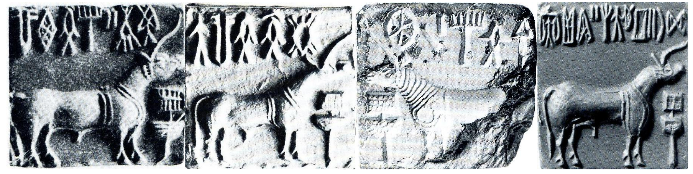

<b>Figure 2a.</b> A snapshot of the 'Indus Seals Dataset(RMRL)'

<b>Figure 2b.</b> A snapshot of the 'Indus Seals Dataset(Crawled)'

In order to build the deep learnt Text/No-Text patch classifier of the region filtering phase(to be discussed in the upcoming section), a dataset derived from the Indus Seals Dataset was formulated. This dataset consisted of three classes namely, Text, NoText and Both, which contained those seal regions containing(Text), not containing(NoText) and partly containing(Both) the Indus text. For obtaining these regions the naive Selective Search[] algorithm was run over the images of the base dataset, and the resulting regions that were improper and insignificantly sized and hence contributing to noise in the dataset, were removed. Further, these regions were then manually grouped into one of the three classes resulting in the  dataset referred to as the **Text/No-Text Dataset**. In total, the dataset consisted of 2091 entries of which 652 were Text, 1055 were NoText and 384 were Both regions.

<b>Figure 3.</b> A snapshot of the 'Indus Text/No-Text Dataset'

In the process of experimenting with the symbol classification task and laying grounds for future work, a subset of the Indus Seals Dataset was used to formulate the **Symbols Dataset**. For this purpose, the 350 images of the Indus Seals Dataset crawled from the web, were manually grouped into two classes, one containing all those seal images that have a Jar sign in them and another consisting of those void of a Jar sign. Thus resulting in a binary dataset that was primarily used by the Jar sign classifier (to be discussed in the Results section), which had 168 images with a Jar sign and 182 without a jar sign of the 350 images in total.

<b>Figure 4.</b> A snapshot of the 'Symbols Dataset'

### Architectural Design
The Indus Symbol segmentation engine, has various modules that form the sequential pipeline through which the input image is fed and the symbols are recognized. The architectural design has the following modules in sequence, Region Proposal module, Text Region Filtering module, Symbol Segmentation module and Symbol Identification module. These modules in-turn have sub modules as discussed below, that help achieve the intended task.

<b>Figure 5.</b> Architectural design of the 'Indus Symbol segmentation pipeline'

####Region Proposal
This module is responsible for extracting the seals as a whole from the given image and coming up with possible regions of interest, that have a high possibility of containing an Indus symbol, animal, deities or any ancient object. This module has various sub modules as discussed below that help achieve this purpose.

The **extract seal sub module**, takes the given image and removes the unnecessary background information, thus extracting the seal portion alone. In order to achieve the same, we smoothen the gray scaled image using Gaussian Blur, as the Indus Seals are characterized by heavy noise, owing to the wear and tear these artifacts would have undergone all these years. Following this, the images are thresholded at the seal's background mean pixel value following another level of Gaussian Blur, the repeated blurring ensures that only the most prominent edges will be detected, in our case the edges of the entire seal only. Then, we perform an optimized Canny Edge[] detection over this labeled image to get the edges, from which the contours are obtained and the bounding rectangular box around the seal is calculated. In specific we use Canny edge detection as it has two main features that best suits the Indus Seals we have in hand, namely Non Maximum Suppression and the Hysteresis Process, wherein the the edges' candidates which are not dominant in their neighborhood aren't considered to be edges and given a candidate which is in the neighborhood of an edge the threshold is lowered, while moving along the candidates.

The **selective search sub module**, is based on the SelectiveSearch object recognition algorithm[]. The selective search is used as a region proposal algorithm, which, given an image, proposes various regions of interests that is more likely to have an object within it, in our case, they are the Indus Script symbols or depictions of animals like bull, unicorn, deities and ancient objects. Moreover, it is the fastest algorithm to compute ROIs and it combines the advantages of exhaustive search and segmentation. Like segmentation, the image structure is used to guide sampling and like exhaustive search, it captures all possible object locations invariant of size and scale, making it the optimal choice for our case. It basically performs hierarchical grouping of region proposals based on colour, texture, size and fill to propose the best ROIs. It was also used as the Region Proposal mechanism for R-CNN [by Girshick et al]^. However, as the raw ROIs proposed by Selective Search does not suit our use case of extracting text regions, a greedy grid search over the 4 selective search parameters was performed to identify the combination that best models the use case at hand. Once the parameters were fine tuned, the region proposals were relevant enough but were really high in number and were mostly approximations and generalizations of each other.

Therefore,in order to reduce the number of regions proposed and to increase the quality of the region proposals, the following hierarchical grouping methods were devised and applied over the fine tuned selective search results, it includes four methodologies to group the basic region proposals, it is to be noted that, these were applied on images scaled to 512x512 or 256x256 or original size. They are, **merge concentric proposals**, it was used to merge those proposals that were focusing on the same object with just small variations in the position and area being covered, and replaced them with the mean rectangle of all the concentric proposals. This was done in order to minimize the almost repetitive region proposals. Then, **contained boxes removal** was performed to remove the proposals that were subsets of an encompassing region proposal, or if some fraction of each object within a region was also proposed along with the full region proposal, then, only the overall proposals were retained. The main idea here is, to only consider whole symbols or objects in the region proposal, rather than going with each part of it. Further, the **draw super box** function was used to replace all the proposals that were overlapping each other such that a single region was proposed as two different overlapping regions. The percentage overlap of such proposals was calculated and thresholded, all those pairs of regions having more than the thresholded overlap amount were replaced by a single minimal super box that bounded both the proposals. Finally, the **draw extended super box** function was used to replace those regions in hand, that were continuous regions in the seal, arranged along the horizontal or vertical axes of the image. As all the regions along the same axis belonged to a single piece of text normally, all these were replaced by a single horizontal/vertical super box. The last two groupings makes much sense with the Indus seals context, as all the text in the seals are mostly arranged along a line, rather than being placed in a haphazard fashion.

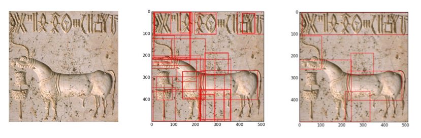

<b>Figure 6.</b> Region proposal sample

####Text region filtering (using Convolutional Neural Networks)

The curated region proposals from the previous stage of the pipeline have both text and non-text regions being proposed, sometimes a single region proposal might even have both text and non text portions in it, this makes handling such composite regions a tough task. Thus, these curated set of ROIs in the given image containing a seal is fed into the text region filtering module. The main idea of filtering these regions of interest, is to be able to, isolate out only those regions that have Indus text/symbols in them from all the other proposals that have non-text content or partial text/symbol content, however in the latter case there involves some further trimming to get only the text out of those composite region proposals, which is discussed in the later part of this section. 

Constructing this **Text/No-Text filter sub module**, involves building a machine learned model that can learn the various characteristics that differentiate a text portion from a non-text portion, in any given Indus seal image. Now this makes up a Computer Vision challenge and in particular, it boils down to a Image classification problem, wherein we intend to classify the given images of regions of interest into three classes, namely, Text, No-Text and Both. This problem at hand might appear to be solvable by a very simple template matching or pattern matching algorithm, but, given the use case of Indus Scripts, this turns out to be really complex and interesting problem. The Indus seals at our disposal and the ones to come out from archaeological sites are not as perfect in state as they where thousands of years ago, they have been subjected to serious wear and tear over time and have lost their originality, and what we have today are the remains of the great civilization, and performing image classification on such data, wherein most of the seals are broken, scratched and worn out. Some other major challenges that we face here are due to the fact that, the seals and sealings add different elevations to the text, some seals are partially erased, aren't uniform in scale, text size and spacing, they have different lighting conditions, they are very similar to one another, there are nearly 417 symbols/alphabets [] that constitute the language and a above all of this we only have 3000+ images at our disposal to be able to learn a model robust to all such variations.

The various image classification challenges that these complexities entail are, scale variation, deformation, illumination conditions, background clutter and intra class variations. Our goal was to build a image classification model that is invariant to the cross product of all these variations, while simultaneously retaining sensitivity to the inter-class variations. This is no usual image classification problem, where features used to model the images are hand crafted to suit the purpose, with complexer challenges at hand, instructing the computer where and what to look will not be viable solution, the possible solution to the problem is crafting deep learned features that are capable of adapting themselves on learning about what to focus on and where to look in the images given the requirements and training samples, instead of hand-crafting it. It also enables learning a hierarchy of features with less human intervention, and all of this, with just minimal or no pre-processing.

The combination of deep learning and computer vision, calls for a very popularly sought after and powerful machine learning algorithm, the Convolutional Neural Networks(CNN). The concept of CNNs was inspired from the actual working of the visual cortex of the animal eye and how the neurons processes images and responds towards overlapping regions tiling the visual field. With such biological relevance, it not only acts as a deep features extractor but also as a classifier. Like other feed-forward artificial neural networks, the CNNs also have various layers, but not all the layers do the same task, there are different types of layers, the convolution layer, pooling layer, LRN[], ReLU[], dropout layer, full connected layer and SoftMax layer, to name a few. Each of these layers perform a specific task and have a number of hyper parameters that can be tuned to suit the use-case at hand. The blueprint that describes how these layers are stacked together along with the hyper parameter configurations is referred to as the CNN's Architecture.

Some of the famous CNN architectures used by image classification engines trained on huge datasets like the ImageNet[] are, LeNet[], AlexNet[], VGGNet[] and GoogLeNet[]. In general, the CNNs need datasets of size greater 1 Million data points, to learn and perform fairly well, but in our case the dataset size is very small, having only a few thousand data points. Moreover, there is no solid process to architect the CNN, it is a trial and error mechanism which is perfected over time and thereby is considered an art. This makes the idea of training a CNN from scratch with minimal data and a new architecture, completely impossible. But, we can take the weights of an already trained CNN and fine tune it to suit our purpose of building a text filtering "text/no-text" classifier. 

On surveying the various CNN architectures[] for fine tuning purposes, we finalized on the, the most deepest, efficient and lightweight architecture, the GoogLeNet[], which was designed for object classification and detection problems and best suits our needs. The GoogLeNet is a 22 layers deep network and has 9 Inception (network within a network) modules and was crafted as a submission for ImageNet Large-Scale Visual Recognition Challenge 2014 (ILSVRC14) which achieved the state of the art results in the challenge[]. The main key concept to improving the performance of a convolutional neural network is to increase its size, but the size gets limited by the computational power in hand, GoogLeNet leverages computationally efficient constructs and increases the depth and width of the network without much overhead. It also harnesses the Network-In-Network architecture[] for improving the representational power of a neural network. The GoogLeNet architecture starts off with a set of extra layers in addition to its Inception network, it consists of two convolution layers one with a 7X7 filter and stride 2, another with a 3X3 filter and stride 1, interlaced with max pooling layers of 3X3 size. Followed by the 9 characteristic Inception networks stacked over each other and are grouped into 3 levels, the predictions happen at each level along the network and it is observed that the most deepest level gives the best accuracies. The first level has two inception layers (3a and 3b), followed by level two with 5 inception layers (4a, 4b, 4c, 4d and 4e) and finally level three with two layers (5a and 5b). At each level, predictions are done by a set of layers consisting of a 5X5 average pooling layer, 1X1 Convolution layer with stride 1 followed by two Fully Connected layers and a SoftMax classifier.

<b>Figure 7.</b> The GoogLeNet Architecture

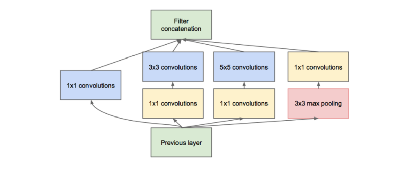

<b>Figure 8.</b> The Inception Module

As discussed earlier, training a CNN from scratch is not a great idea with a comparatively small dataset, and given the size of CNNs, datasets like ImageNet take 3-4 weeks to train even with multiple GPUs. Therefore, pre-training a network on a larger dataset, and initializing those weights and filters before training with the primary dataset, is a very common practice and is referred to as Transfer Learning, as the weights and filters learned by the CNN on some other dataset is fine tuned and transfer learned to suit our dataset. In our case, we used the GoogLeNet's ImageNet trained final snapshot released by BVLC[] with unrestricted access for initializing our CNN, thus saving a lot of computational cycles and time. In our case, the Indus seals dataset at hand is small and is different from the ImageNet dataset, therefore using the freshly initialized CNN with ImageNet weights as a mere feature extractor is not appropriate and will lead to a poor model. So, we opt for fine-tuning the convolutional neural network.

The practice of fine-tuning the convolutional neural network with weights initialized from training another dataset is based on the observation that the lower level layers of a CNN describe more generic features like Gabor Filters, blob detectors or edge detectors and are not specific to a particular dataset or task, but in general they are applicable to many datasets and tasks, but the later layers of the CNN becomes progressively more specific to the dataset. Therefore, this eventual transition of the features from general to specific by the last layer of the network, leads to initializing the GoogLeNet's CNN architecture with ImageNet trained weights from BVLC and retaining the rich lower level filters of the network by setting the learning rate for these layers to 0. Wherein, the later layers' learning rates where doubled than normal and the links to the final SoftMax layer was rewired to have just 3 output classes to suit our Indus text filtering use case.

These convolutional neural networks where built, trained, transfer learned and fine-tuned using the Caffe deep learning framework developed by “Yangqing Jia” under Berkeley Vision. This is the most efficient and light weight implementations of the CNNs in C++, with support for multiple GPU based training, the other frame works like Tensor Flow, are less intuitive and 3 times slower than the Caffe implementation, though the Torch implementation is claimed to be equally fast and efficient, it cannot support multiple GPU training. The Caffe, uses the Google's protobuf specification to specify the CNN architectures as text configuration files, that are translated to in-memory CNN architectures by the frame work. The Caffe implementation with cuDNN trained on Nvidia GPUs is 40 times faster than basic CPU based training.

The text/no-text classifier built, labels the regions proposals as Text, No-Text or Both. Further, in order to generate more precise region proposals, the **trimming region proposals sub module** was built to clip off the partly non text regions and to group all the text regions into one single strip. In order to achieve this, two methods where formulated, namely, Draw TextBox and Trim TextBox. The Draw TextBox method merges those pairs of region proposals, where a Text region and a Both region were overlapping, in order to get whole text regions, into a single TextBox. The Trim TextBox method clips off the non text regions in those pairs of region proposals, where a TextBox/Text region and a NoText were overlapping, in order to get the trimmed text regions clipped into a single TextBox. As a final result of this filtering and trimming, we get the perfect text only region proposals.

<b>Figure 9.</b> Text region extraction sample

####Symbol segmentation

The precise text regions from the previous stage are fed as inputs into the Symbol Segmentation stage of the pipeline. The main aim of this module is to segment out the characters/symbols separately from the entire text region, for this purpose the Selective Search algorithm was not effective. So, a customized algorithm that stacked together various basic image processing techniques and thresholding techniques proposed by Otsu[], was devised. The various steps of the algorithm are described in [].

	Segment_Symbol(Image I)
		1. I = GrayScale(I)			 
		2. I = OtsuThresholding(I)  	# Returns a discrete binary image
		3. I = GaussianBlur(I) 		# Removes noise and smooth-ens the image 
		4. Components = ConnectedColourComponents(I)	
									# Groups the connected subregions in the image, based on color
		5. ROIs = Combine(Components)	
									# Combines the components based on a mix of methods from the Region proposal and Text region filtering modules, discussed previously
		6. SubImages = Crop(ROIs, I)	# Crop the region proposals based on generated ROIs

This algorithm, extracts out the individual symbols and thus reduces the OCR problem to a much simpler symbol classification problem.

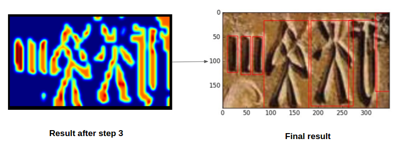

<b>Figure 10.</b> Text region extraction sample

####Symbol Identification

The individual character/symbol crops from the symbol segmentation module of the above pipeline, are to be classified into one of the 417 classes of Indus symbols according to the Mahadevan Corpus (M77). In order to train such a convolutional neural network classifier from the meager data we have, we need to generate more artificial data by augmenting the available base dataset with variations and noise, using the Image Preprocessing and Data Augmenter sub module. This sub module was built in Python, inspired from Keras[] a deep learning library for Python with Google's TensorFlow back-end. This is capable of performing various image pre-processing tasks like feature wise center, sample wise center, feature wise std normalization, sample wise std normalization and ZCA whitening. The data augmenter was developed to generate more data that could lead to a bigger and better dataset by performing the following operations on the base images we have, which include, vertical and horizontal flips, random shear, crop, swirl, rotate, scale and translate, all done repeatedly with randomized parameters. This is believed to warrant towards building a more robust and generalized model for classifying/identifying Indus script symbols.

As a first step to symbol identification, an experiment was conducted to detect the presence of the most frequently encountered Indus symbol, the Jar, from the given Indus seal images. The Symbols dataset collected by crawling the web was used for this experimentation. A CNN architecture mainly used for OCR on English text, inspired from [] was used for building a deep feature extractor cum classifier for Jar symbol presence detection purpose. The architecture has two Convolution layers stacked over each other, both with a kernel size of 5X5 and a stride shift of 1, the first Convolution layer is configured to produce 20 output filter banks which is then stepped up to 50 in the following convolution layer. This layer is followed by a Dropout[] layer to prevent the model being trained from over-fitting the dataset in hand, as the dataset in hand is quite small. This was followed by a ReLU layer, for non-linear rectification sandwiched in between two Fully connected layers. The first fully connected layer had 500 output values which was boiled down to 2 in the final fully connected layer, who's values were classified by the SoftMax classifier into the most appropriate of the two candidate classes. The model thus trained was successfully able to give a binary result about, as to whether the given image had a Jar sign or not with an accuracy of 92.07%. The main idea of the paper was to boil down a complex OCR task over the Indus seals into a simple Image Classification task, the symbol identification was just an experiment, more detailed version to be discusses in the upcoming paper.

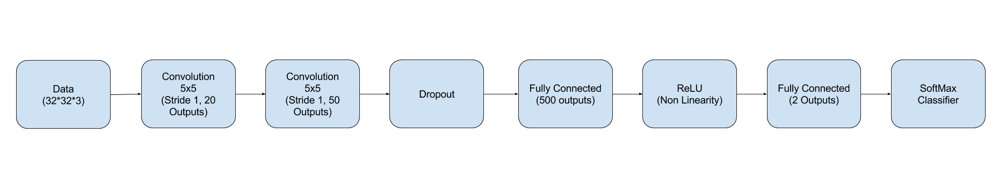

<b>Figure 11.</b> The Jar Sign Classifier's CNN Architecture

## Results
In order to evaluate the deep learned Indus Symbol segmentation pipeline, we isolated a set of 50 images from the original Indus Seals Dataset gathered form RMRL[], which was not used to optimize or train the various modules of the pipeline. We will now present the empirical results and accuracies of the various modules in the pipeline, evaluated over these set of 50 images. Firstly, the images will be evaluated against the Region Proposal module, the main aim of this module is to remove the background clutter and successfully propose potential regions of interest in the seals, where the possibility of having a Indus symbol or object is higher. The first stage of the region proposal module achieves background clutter removal, by smoothening the gray scaled image using a Multi-dimensional Gaussian Filter with a kernel of standard deviation(sigma) 3.0, this value was obtained after a search over three values (1.0,2.0,3.0). The thus obtained image was thresholded at a RGB channel value of 250 with an aim to remove all the whitish regions that constituted the background in which the seals where found. Iteratively, the thresholding was also done at a RGB value of 200, as in some cases the seals where surrounded by noise that didn't constitute a pure whitish part alone. These thresholded images where gray scaled and further smoothened with Gaussian Blur of 7x7 kernel size. Further, we perform an optimized Canny Edge[] detection over this image, where the lower and upper thresholds are adjusted according to the image at hand, by computing the median of the single channel pixel intensities. Once these edges have been marked over the image, connected components analysis is performed and the connected regions are labeled to get the bounding rectangular box surrounding only the seals.

Once the cropped seal images have been obtained they where scaled to a standard 512x512 or 256x256 or left with the original image size, before the other modules in the pipeline where applied over them, depending on whichever scale gave the best results down the pipeline. As discussed earlier, the next stage applied the Selective Search algorithm to get the candidate region proposals and as the thus obtained raw proposals didn't suit our needs, the algorithm was fine tuned by grid searching over the 4 the Selective Search parameters and the following values where finalized, namely, Scale - 350, 450, 500 (higher the value larger the clusters in Felzenszwalb segmentation[]), Sigma - 0.8 (Width of Gaussian kernel for Felzenszwalb segmentation[]), Min Size - 30, 60, 120 (Minimum component size for Felzenszwalb segmentation[]), Min Area - 2000(Minimum area of a region proposed). 

Once these base ROIs were obtained, the region grouping mechanisms, namely, merge concentric proposals, contained boxes removal, draw super box and draw extended super box, where applied to get minimal, precise and desirable region proposals for the given image. The "merge concentric proposals" operated with a dynamically calculated threshold which equated to 14% of the arithmetic mean of the ROI box's dimensions, all those boxes offset from each other by only the calculated threshold get merged into a single enclosing box. The "contained boxes removal" function, checks for 100% overlap between boxes and merges them. The "draw super box" method combines those boxes that overlap to more than 40% of each other's area. The "draw extended super box" method also uses a dynamically calculated threshold which equated to 6% of the arithmetic mean of the ROI box's dimensions, all those boxes that were not overlapping but were along the same horizontal or vertical axes offset only by the calculated threshold amount, were extended into a single box. 

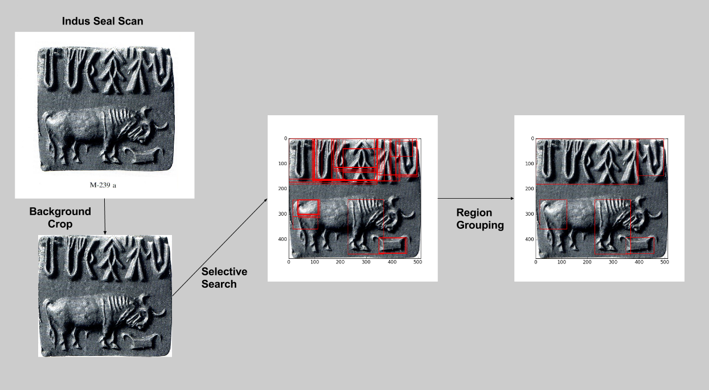

<b>Figure 12.</b> The Region Proposal Modules sample flow

The hence obtained candidate region proposals were of text, non-text or hybrid (combination of text and not-text) type, as discussed earlier, they were fed into the region filtering module. This module constitutes the core part of the pipeline and has the Convolution Neural Network Classifier, that is capable of differentiating between the three region types and segregating the text regions alone. In order to train this classifier, the "Text/No-Next" dataset was used. The data was split in a 70:30 ratio for training and validation respectively, based on the stratified random sampling technique, wherein the data proportions across classes was equally weighted during the split. That is, of the total 2091 ROI crops, 1466  ROI crops (Text - 458, NoText - 739, Both - 269) were used for training and the remaining 625 ROI crops (Text - 194, NoText - 316, Both - 115) were used for testing. In order to train the Convolutional Neural Network, the Caffe deep learning framework with GPU capabilities was configured over a Nvidia GTX 660M graphics card with 2GB memory. The GoogLeNet[] architecture was used as the base CNN architecture to train a deep feature extractor for this purpose with a SoftMax classifier mounted in the end of the network that learned to classify the candidate regions. The GoogLeNet architecture's configuration specification [] was modified so as to disable learning in the initial stages except the last 3 inception modules namely - (4e, 5a, 5b) of the GoogLeNet architecture. The learning rates for these modules were stepped up by 2 times from the default, to enable active learning as the features later learned are specific to the dataset. Then sample-label map for the training and testing data was framed. Following this the entire network was initialized with the weights already learned by the model over the ImageNet images except for the fully connected SoftMax classifier links, which were randomly initialized with the Xavier initialization[] technique. The data layer of the network (IMAGE_DATA) was specified to perform in-memory scaling of the randomly sized regions into a standard 256X256 scale, which was randomly cropped at runtime into a 224X224 sample, thus ensuring a position invariant model to be learned. The data layer also included a mean value subtraction phase, where the default GoogLeNet's mean values (R-104, G-117, B-123) were used for normalizing the images. 

The Stochastic Gradient Descent solver was used for updating the weights during back propagation phase of the Neural Network's training, this solver had a base learning rate of '0.001', this low value is to not greatly offset the already learned weights from ImageNet images, in the last three Inception layers. The learning rate was updated using a step policy, at every 1000 steps with a momentum of 0.9, weight decay rate of 0.0002 and a gamma value of 0.1. The updates to the learning rate happens according to the formula `newLearningRate = baseLearningRate * gamma ^ (floor(iterationNumber / step))`. The training and validation batch sizes were 30 and 20, with a maximum iteration of 20000 (approximately 14 epochs). The lower number of epochs is attributed to the fine tuning of the network as it is already initialized with ImageNet pre-trained weights. This resulted in a model with an accuracy of about 90%, 89.3% to be precise, when evaluated over the validation set.

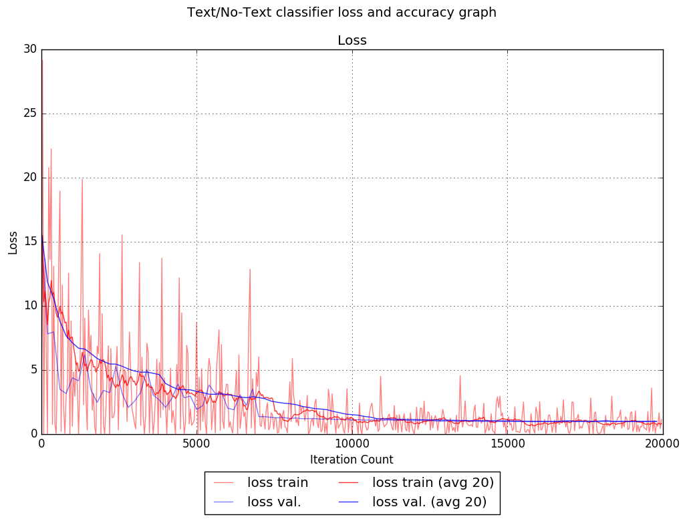

<b>Figure 13a.</b> The Text/NoText CNN's loss plot

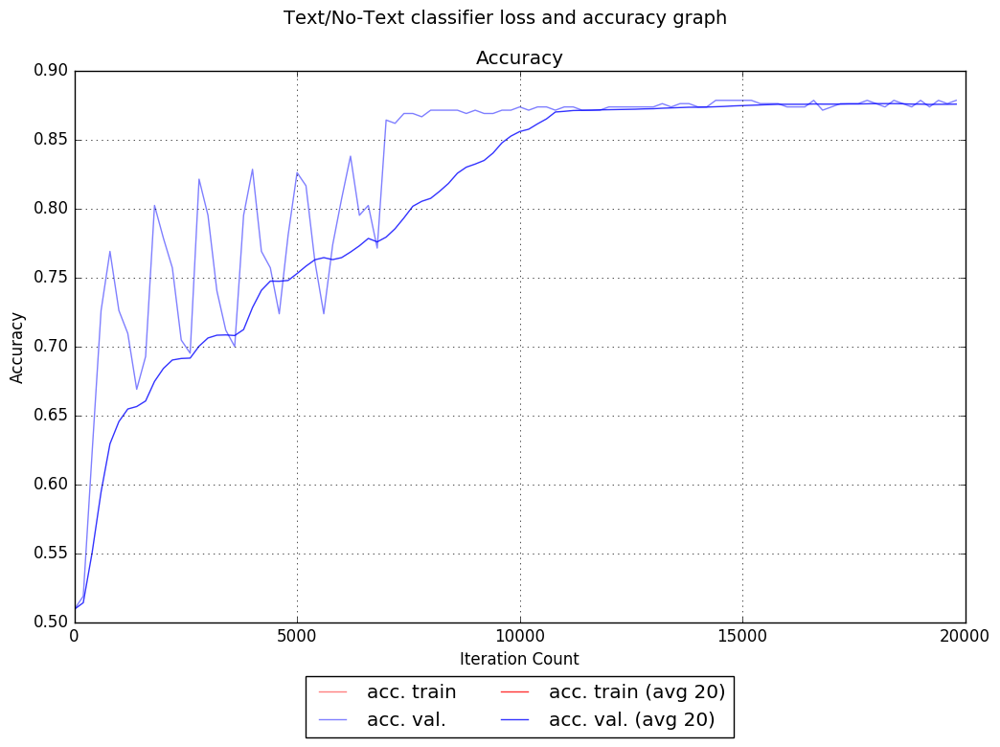

<b>Figure 13b.</b> The Text/NoText CNN's accuracy plot

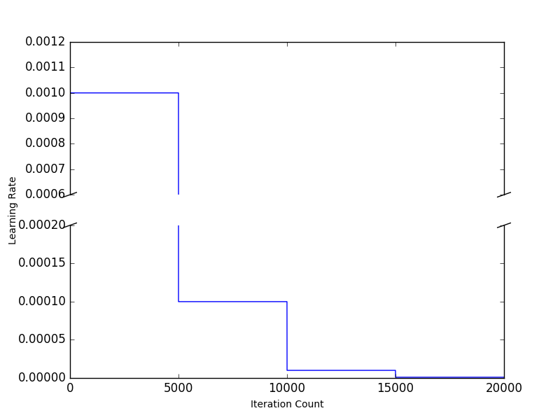

<b>Figure 14.</b> The Text/NoText CNN's learning rate plot

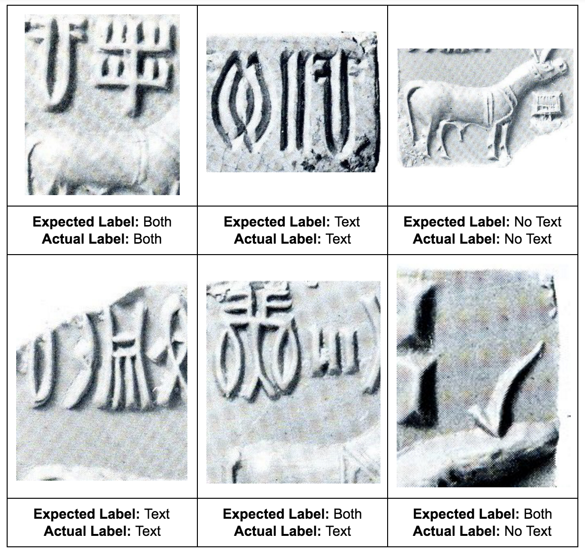

<b>Figure 15.</b> The Text/NoText CNN's sample classification outcomes

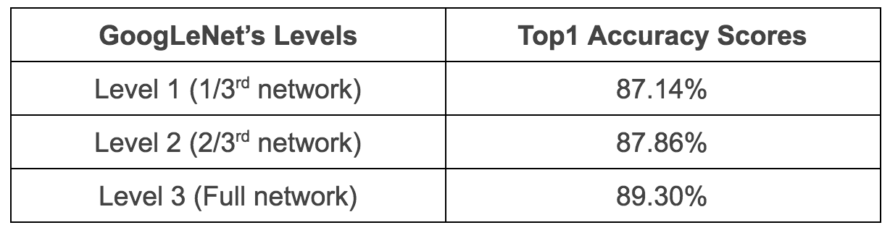

<b>Table 1.</b> The Text/NoText CNN's Top-1 Accuracy Scores

Once the Text/No-Text classifier was trained, it labels the regions proposals as Text, No-Text or Both, but in order to generate perfect text only regions, the Draw TextBox and Trim TextBox functions were employed over the classified images, as discussed before. The Draw Text box method uses a dynamic threshold over the 'text' boxes' merge operation, it is calculated by computing the arithmetic mean of the width and height of the cropped region and taking 25% of it. If any two candidate 'text' boxes where within this threshold difference, both in terms of height and width they were merged into one single super box, that covered the entire region, irrespective of whether they were overlapping or not. This attributes to the fact that, most of the Indus Seals have the text symbols arranged either horizontally or vertically in an order. As a next step, all the overlapping 'both' boxes and 'text' super boxes, where merged into one, if they at least had a 20% overlap across their width or height. The thus obtained boxes, where subject to the Trim TextBox function, which took the 'no text' boxes that were overlapping with the above obtained boxes to 70% across the height and 20% across the width or the vice versa, were cutoff of the base boxes, thus trimming away the non text regions present in the 'both' boxes that we previously combined. The 70-20 combination used again attributes to the observed generic horizontal or vertical ordering of the Indus seals symbols. Finally, out of the 50 randomly picked test samples, the complete text regions were successfully extracted out from 43 seal images, while the pipeline failed in extracting the full text regions in the other 7 cases, it was successful in pulling out partial text regions that missed just a couple of symbols at max. Thus projecting a perfect case accuracy of 86 %.

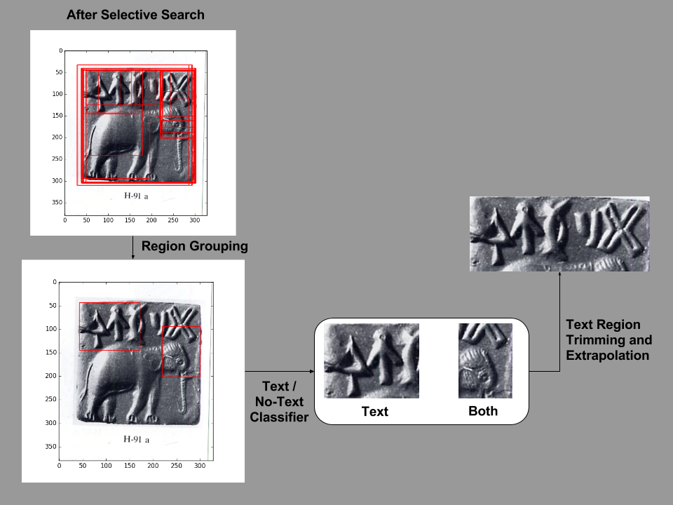

<b>Figure 16.</b> Text region filtering module's sample flow

These precise text only regions obtained so far, where then passed through the Symbol Segmentation module's pipeline in order to clip out the individual symbols, making them suitable for further symbol classification. The first stage in this pipeline employed a thresholding technique, to obtain the binary images. We used Otsu's thresholding for our purpose, after experimenting with various techniques like, Mean, Triangle, Li[], Yen[], IsoData[] and Minimum thresholding, as this suited our purpose more accurately. These binary images were noisy and hence a Gaussian Blur with a sigma value of 3.5 was applied over them and image mean subtraction was performed, thus getting a smooth and noise free binary, suitable to highlight the symbols precisely. Then all the pixels in the image were labeled based on the neighboring pixel's value in all 4 directions (up, down, left, right), if no labels were given to any specific pixel, it takes a new label value. All the pixels with the same labels are connected with each other and hence constitute a blob. Bounding rectangular boxes were drawn around these blobs, thus producing a many overlapping and random boxes, these were then refined using the contained boxes removal, draw super box and draw extended super box techniques discussed in the region proposal module, with minor changes in the parameter used for the draw super box and draw extended super box methods. The overlap threshold in the draw super box method was dropped down to 15% and the thresholding was removed from the draw extended super box method. When the symbol segmentation module of the pipeline was applied to the sampled 50 test images after the extraction of text regions, it succeed in cropping out the exact symbols from 34 of these samples (consisting of 29 full text regions and 5 partial text regions), while the pipeline did fairly well in 13 other cases (consisting of 11 full text regions and 2 partial text regions), where it was able to mark out most of the symbols individually except for a couple or more of them getting marked in entirety as single symbols, instead of separate ones. The remaining 3 samples failed completely in getting even a single symbol out of the proposed text region, this failure is mainly due to heavily damaged seals and complex seal structure. And hence, this module when scored over the perfect results gets an accuracy score of 68%. The thus far discussed empirical analysis of the pipeline has been summarized in Table 2.

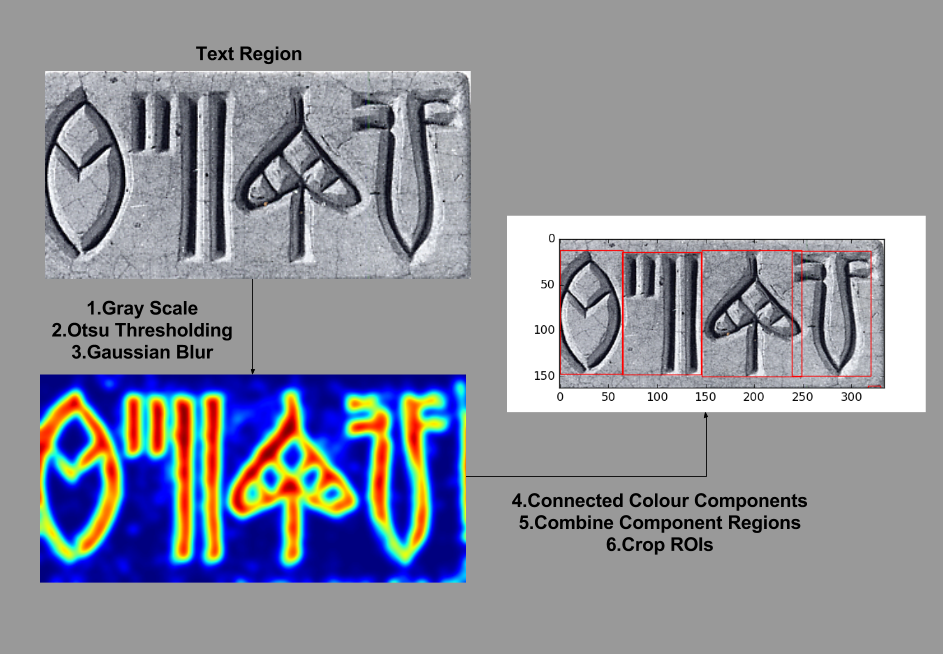

<b>Figure 17.</b> Symbol Segmentation module's sample flow

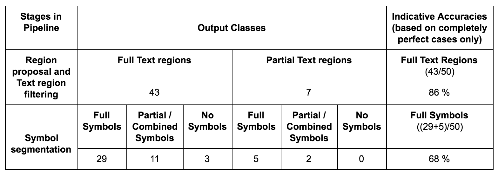

<b>Table 2.</b> The Indus Symbol segmentation pipeline's empirical analysis on 50 randomly sampled seal images

Although, the primary purpose of this paper, was to discuss on how to reduce a complex Optical Character Recognition problem dealing with Indus Scripts into a simple Image Classification problem, we have experimented with Symbol Identification as well, which will be discussed in detail in our upcoming paper. As a primary step to symbol identification, we built a classifier to identify the presence of the Jar symbol given an Indus Seal image, we chose the Jar symbol as it is the most frequent[] Indus symbol. We used a CNN architecture inspired from [], which was primarily used for Optical Character Recognition problems in the English language text. This experimentation uses the Symbols dataset which was split into 70-30 ratio - 246 images(With Jar Sign - 118, Without Jar Sign - 128) for training and 104 images(With Jar Sign - 50, Without Jar Sign - 54) for testing, of the total 350 images. There are only two possible classes in this image classification problem, based on the presence and absence of the Jar symbol in the given Indus Seal; stratified splitting was used to ensure that both the classes had equally weighted number of test and training samples. The images were resized to 32x32, converted to gray scale and the pixel intensities were scaled over 255 as a part of the data preparation layer in the CNN's architecture. The SGD solver configuration used a train and test batch size of 100 and 52 respectively, thus covering the entire test set in 2 forward passes through the network while evaluating the network for accuracy. The network was initialized with a base learning rate of 0.001, momentum of 0.9 and a weight decay amount of 0.0005. The learning rate decay policy was "inv" which was used from Caffe's package of learning rates, and it is updated using the formula `newLearningRate = baseLearningRate * (1 + gamma * iterationNumber) ^ (- power)`, where gamma and power values were set to 0.0001 and 0.75 respectively. The training phase was for 1000 iterations and was performed in the CPU. The thus obtained model when evaluated on the test set gave an accuracy of 92%, 92.07% to be precise.

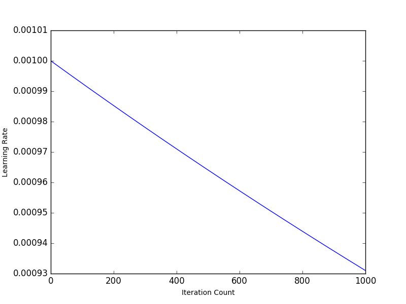

<b>Figure 18.</b> The Jar sign experiment's learning rate plot

## Discussion
This deep learned pipeline was developed with an aim of reducing an optical character recognition problem into a simple image classification problem, thus paving way to symbol identification and thus extracting the Indus Script out from the seals and artifacts, into a computer readable format, like a sequence of numbers. There are as many as seven cases that have challenged the performance of this pipeline, let see how effective was the system to all these. **Case 1:** The generality of the model, it not only works well with perfectly scanned or photographed seal images, it work fine with noisy images as well, as it was also trained with images crawled from the web, which exposed the pipeline to casually photographed scenarios. [IMG]. **Case 2:** Straightforward seals with simple structure, without much clutter and damage, the model was perfect in extracting the individual symbols out of the seals as the images in this category were noise free. [IMG] **Case 3:** Simple seals with unseen symbols in them, the model's text/no-text classifier has learned to generalize over the dataset in hand, thanks to the deep features learned by the model, it had no problems in recognizing unseen symbols/text parts as the features used by it to classify in text/no-text/both were not dataset specific. [IMG]. **Case 4:** Incomplete region proposals, in some cases the selective search sub module of the region proposal stage might fail to recognize all the objects(symbols, animals and humans), but in most of the cases the hierarchical region grouping mechanisms cover up for this. In some exceptional cases as in[IMG], at maximum a couple of symbols get missed out, in this case the crab sign has been missed from the proposed text region bounding box. **Case 5:** Seal images with background noise, the pipeline developed is not tolerant to the seal being surrounded by some background, but this case is successfully handled by the "extract seal" sub module of the region proposal stage, which uses a modified Canny Edge detection based algorithm to cut out the given seal image only off from its background noise. [IMG] **Case 6:** Heavily damaged and worn out seals, the symbol segmentation pipeline succeeds in extracting the text regions out of the Indus seals, but in some cases fails to extract the symbols perfectly out of these text regions, as the damage in the seals affects one or more continuous symbols, making the system to combine them into one, rather than splitting them individually. [IMG]  **Case 7:** Completely disorganized seals, such seals don't have any seal structure as in [IMG], they have a haphazard arrangement of symbols in the seal. Our pipeline does a decent job in getting most of the text regions out of it, missing a few owing to a more difficult seal structure.

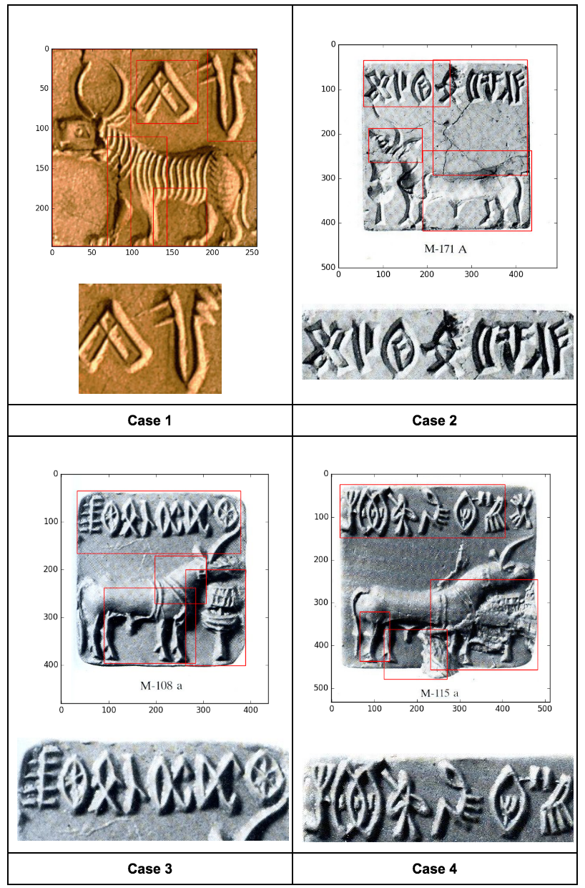
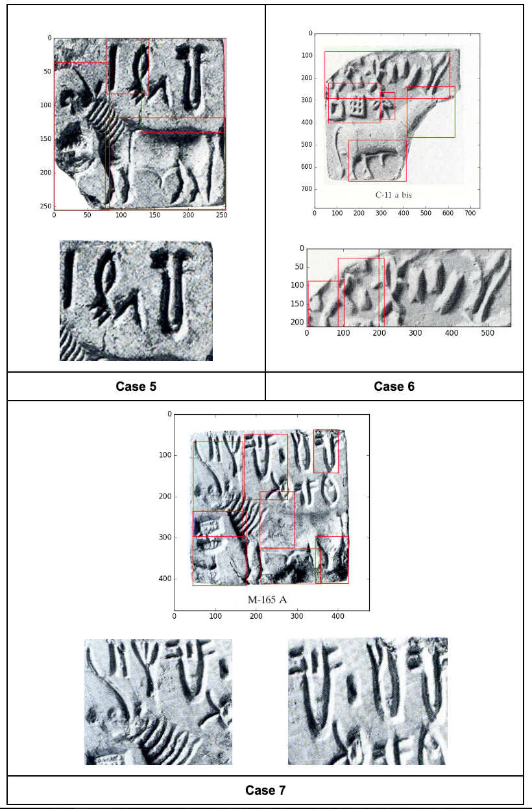

<b>Figure 19.</b> Samples illustrating the various cases of the discussion

## Conclusion
In conclusion, the proposed symbol segmentation pipeline's architecture is capable of reducing a complex optical character recognition problem on the Indus Script into a relatively simpler image classification problem that performs perfectly well in almost all cases, but in some rare cases the results are not precise, where the seals are heavily damaged or the text arrangement in the seal structure is very complex for the pipeline to read. From all the discussions it is clear that the Text/No-Text classifier sub module of the Text region filtering module is very mature and performs well, thus contributing to a more stable region extraction pipeline, even if some cases get missed by this module, they are covered up by the hand crafted region proposal mechanisms devised as a part of this pipeline. However, some rare limitations still exist in the pipeline, such as in Case 4, due to the "Selective Search" misbehavior that fails to recognize certain symbols along the seal edges. And in cases 6 an 7 it was really tough to get it perfect, as they dealt with damages in the seal, but the pipeline has done a decent job in getting at least the partial regions out of it. As a forerunner to the symbol identification challenge that follows the segmentation pipeline, the Jar sign experimentation has proved that the symbol classification task is very doable. This work also lays a solid foundation for building a real time system that can read Indus scripts from camera photographs of seals and infer interesting information from the textual architecture of the scripts, thus giving the incredible power of reading and inferring knowledge from Indus seal images captured by a simple smart phone camera, in the hands of a lay man. This very system will be of primary focus in our upcoming research in this track.

## Acknowledgments
We wish to acknowledge the generous assistance of Indus Research Centre of the Roja Muthiah Research Library, in meticulously working on scanning all of the Indus seals from their archives and making it available to us in the form a well sorted dataset. We are grateful to Harappa.com for their kind permission to use the picture of an Indus seal in the paper^.

[update the accurate dataset info in the dataset section^]
[update references to images, papers, tables^]

## References
- https://en.wikipedia.org/wiki/Indus_script
- The Indus Script: Texts, Concordance and Tables. Memoirs of the Archaeological Survey of India
- Statistical Analysis of the Indus Script Using n-Grams
- http://journals.plos.org/plosone/article?id=10.1371/journal.pone.0009506
- http://www.rmrl.in/
- https://perso.limsi.fr/vezien/PAPIERS_ACS/canny1986.pdf
- http://koen.me/research/selectivesearch/
- http://koen.me/research/pub/uijlings-ijcv2013-draft.pdf
- https://www.cs.cornell.edu/~dph/papers/seg-ijcv.pdf
- http://cs231n.github.io/classification/
- www.cs.unc.edu/~wliu/papers/GoogLeNet.pdf
- CNN http://yann.lecun.com/exdb/publis/pdf/lecun-01a.pdf
- http://cs231n.github.io/convolutional-networks/#architectures
- M. Lin, Q. Chen, and S. Yan. Network in network. CoRR, abs/1312.4400, 2013.
- Caffe: Convolutional Architecture for Fast Feature Embedding paper
- http://arxiv.org/abs/1411.1792
- http://cs231n.github.io/transfer-learning/
- https://github.com/BVLC/caffe/tree/master/models/bvlc_googlenet
- http://bvlc.eecs.berkeley.edu/
- https://engineering.purdue.edu/kak/computervision/ECE661.08/OTSU_paper.pdf
- Multi-digit Number Recognition from Street View Imagery using Deep Convolutional Neural Networks - http://arxiv.org/abs/1312.6082
- Felzenszwalb - https://cs.brown.edu/~pff/papers/seg-ijcv.pdf
- Selective Search (Selective Search for Object Recognition, Uijlings et al.)
- https://github.com/BVLC/caffe/tree/master/models/bvlc_googlenet
- http://jmlr.org/proceedings/papers/v9/glorot10a/glorot10a.pdf [xavier]
- http://journals.plos.org/plosone/article?id=10.1371/journal.pone.0009506
- https://github.com/pannous/caffe-ocr
- https://www.cs.toronto.edu/~hinton/absps/JMLRdropout.pdf